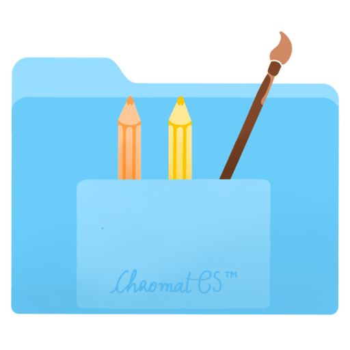

# iConvert

  

<h1 align="center">
  Simple File Conversion for macOS
</h1>

  
  
  

---

## About iConvert

Want to convert your files into a bunch of different formats? Just right-click on the file you want to convert and if it's supported, you'll see an iConvert menu.

iConvert is a simple, lightweight Finder extension that allows you to convert files between various formats directly from the context menu. No need to open separate applications or use online converters!

## Supported Conversions

Currently, iConvert supports the following conversions:

- **PNG to JPG**
- **PNG to WebP**
- **JPG to PNG**
- **JPG to WebP**
- **HEIC to JPG**
- **HEIC to PNG**
- **HEIC to WebP**
- **WebP to JPG**
- **WebP to PNG**

## Installation

1. Download the latest version of iConvert
2. Move the app to your Applications folder
3. Open the app
4. Enable the Finder extension in System Settings > Privacy & Security > Extensions > Added Extensions

## How to Use

1. Right-click on a supported file in Finder
2. Look for the "Convert" option in the context menu
3. Select your desired conversion format
4. The converted file will be created in the same folder as the original

## Feedback and Support

We'd love to hear from you! Leave a review and let us know what other conversions you'd like to see.

You can also reach us at contact@untitledapps.at.

## Requirements

- macOS 12.1 or later

## Privacy

iConvert does not collect any personal data. All conversions happen locally on your device.

---

  © 2023-2024 Untitled Apps

# iConvert
